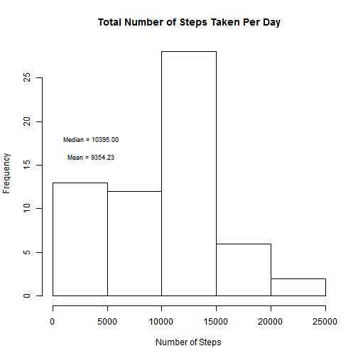
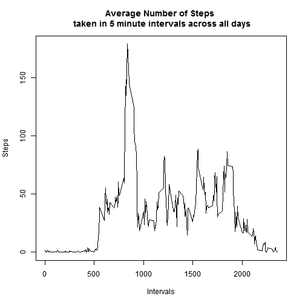
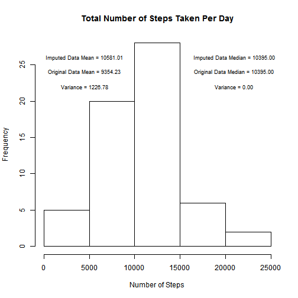
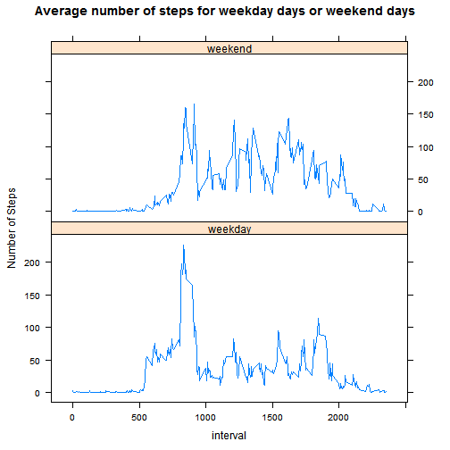

##Loading and preprocessing the data

Load the data.table package.

```
## Loading required package: data.table
## data.table 1.9.4  For help type: ?data.table
## *** NB: by=.EACHI is now explicit. See README to restore previous behaviour.
```


Load the activity dataset and replace NAs by zeros. 
Assumes the activity.csv file is in the current working directory.

```r
activity <- read.csv("activity.csv")
activity[is.na(activity)]<-0
activity <-data.table(activity)
```

##What is mean total number of steps taken per day?

```r
#Calculate the total number of steps taken per day
total_steps_per_day<-activity[,list(steps=sum(steps)),by=date]

#Make a histogram of the total number of steps taken each day
hist (total_steps_per_day$steps,main="Total Number of Steps Taken Per Day", xlab = "Number of Steps")

#Calculate and display the Mean and Median Steps in a day
text(c(3500, 3500), c(16, 18), cex=0.75, c(sprintf("Mean = %.2f", mean(total_steps_per_day$steps)), sprintf("Median = %.2f", median(total_steps_per_day$steps))))
```

 

##What is the average daily activity pattern?

```r
#Calculate the average number of steps taken per day by interval
average_steps_per_day<-activity[,list(steps=mean(steps)),by=interval]

#Make a time series plot (i.e. type = "l") of the 5-minute interval (x-axis) and the average number of steps taken, averaged across all days (y-axis)
plot(average_steps_per_day$interval,average_steps_per_day$steps,type="l",
     main ="Average Number of Steps \n taken in 5 minute intervals across all days",
     xlab="Intervals", ylab="Steps")
```

 

Which 5-minute interval, on average across all the days in the dataset, contains the maximum number of steps?

```r
average_steps_per_day$interval[which.max(average_steps_per_day$steps)]
```

```
## [1] 835
```


##Imputing missing values

Load the clean activity dataset with NAs

```r
#Load the activity dataset with NAs and convert to datatable
activity_clean <- read.csv("activity.csv")
activity_clean <-data.table(activity_clean)
```

Calculate and report the total number of missing values in the dataset (i.e. the total number of rows with NAs)

```r
length(which(is.na(activity_clean$steps)))
```

```
## [1] 2304
```


Create a new dataset that is equal to the original dataset but with the missing data filled in.

```r
#Calculate the mean steps for each 5 minute interval
mean_steps_interval <- activity[,list(steps=mean(steps)),by=interval]
activity_filled <- activity_clean

#Fill in the NAs with the corresponding mean steps for the 5 minute intervals
for (i in 1:length(activity_filled$steps))
        {
        if (is.na(activity_filled$steps[i]))
                {
                activity_filled$steps[i]<-mean_steps_interval[interval==activity_filled$interval[i]]$steps
                }
        }
```


Make a histogram of the total number of steps taken each day

```r
#Calculate the total number of steps taken per day
total_steps_per_day_filled<-activity_filled[,list(steps=sum(steps)),by=date]

#Make a histogram of the total number of steps taken each day
hist (total_steps_per_day_filled$steps,main="Total Number of Steps Taken Per Day", xlab = "Number of Steps")

#Calculate and display the Imputed Dataset Mean and Original Mean Steps in a day
text(c(4500, 4500, 4500), c(26, 24, 22), cex=0.75,c(sprintf("Imputed Data Mean = %.2f", mean(total_steps_per_day_filled$steps)), sprintf("Original Data Mean = %.2f", mean(total_steps_per_day$steps)),sprintf("Variance = %.2f", mean(total_steps_per_day_filled$steps)-mean(total_steps_per_day$steps))))

#Calculate and display the Imputed Dataset Median and Original Median Steps in a day
text(c(21000, 21000, 21000), c(26, 24, 22), cex=0.75, c(sprintf("Imputed Data Median = %.2f", median(total_steps_per_day_filled$steps)), sprintf("Original Data Median = %.2f", median(total_steps_per_day$steps)),sprintf("Variance = %.2f", median(total_steps_per_day_filled$steps)-median(total_steps_per_day$steps))))
```

 

Do these values differ from the estimates from the first part of the assignment? What is the impact of imputing missing data on the estimates of the total daily number of steps?

        - The Mean number of steps increased by the amount.

```
## [1] 1227
```
        - The Median number of steps did not change


##Are there differences in activity patterns between weekdays and weekends?

Create a new factor variable in the dataset with two levels - "weekday" and "weekend" indicating whether a given date is a weekday or weekend day.

```r
myfun <- function (x) 
        {
        wkday <- as.POSIXlt(x,format ="%Y-%m-%d")$wday
        
        ret <- "weekday"
        if (wkday==0 || wkday==6)
                {
                ret <- "weekend"
                }
        
        return(ret)
        }

activity_filled[, c("day") := sapply(activity_filled$date,myfun)]
```

```
##          steps       date interval     day
##     1: 1.49180 2012-10-01        0 weekday
##     2: 0.29508 2012-10-01        5 weekday
##     3: 0.11475 2012-10-01       10 weekday
##     4: 0.13115 2012-10-01       15 weekday
##     5: 0.06557 2012-10-01       20 weekday
##    ---                                    
## 17564: 4.08197 2012-11-30     2335 weekday
## 17565: 2.86885 2012-11-30     2340 weekday
## 17566: 0.55738 2012-11-30     2345 weekday
## 17567: 0.19672 2012-11-30     2350 weekday
## 17568: 0.93443 2012-11-30     2355 weekday
```

```r
activity_filled$day<-factor(activity_filled$day)
```

Make a panel plot containing a time series plot (i.e. type = "l") of the 5-minute interval (x-axis) and the average number of steps taken, averaged across all weekday days or weekend days (y-axis). 

```
## Loading required package: lattice
```


```r
average_steps_per_weekday_weekend<-activity_filled[,list(steps=mean(steps)), by=c("day","interval")]

xyplot(steps ~ interval | day, data = average_steps_per_weekday_weekend, 
       layout = c(1, 2), 
       type="l", 
       ylab = "Number of Steps", 
       main = "Average number of steps for weekday days or weekend days")
```

 


